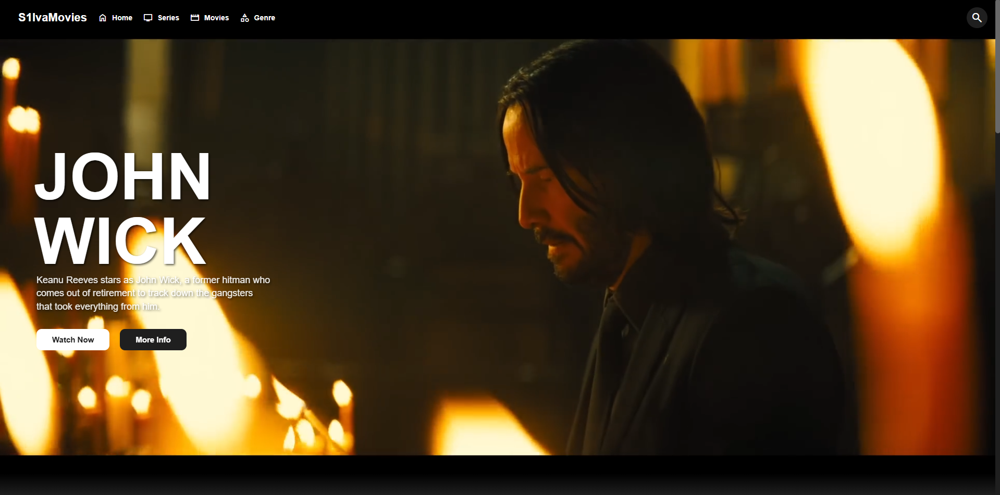

# SilvaMovies


**SilvaMovies** is a front-end web application built with **React** and **Vite** that simulates browsing and watching movies and series. This project is entirely client-side and does not require any backend server or database. All data is managed using static JSON files.

## Installation

### 1. Clone the Repository

First, clone the repository to your local machine using Git:

```bash
git clone https://github.com/SRamoras/S1lvaMovies.git
cd S1lvaMovies
```

### 2. Install Dependencies
Install the necessary dependencies using npm:
```bash
npm install
```

### 3. Start the Application
Start the React application using Vite:
```bash
npm run dev
```

5. **Access the Application**

    Open your browser and go to [http://localhost:3000](http://localhost:3000) to see Storytime in action!

## 📄 License

This project is licensed under the [MIT License](./LICENSE).

## 📫 Contact

For more information, feel free to reach out:


